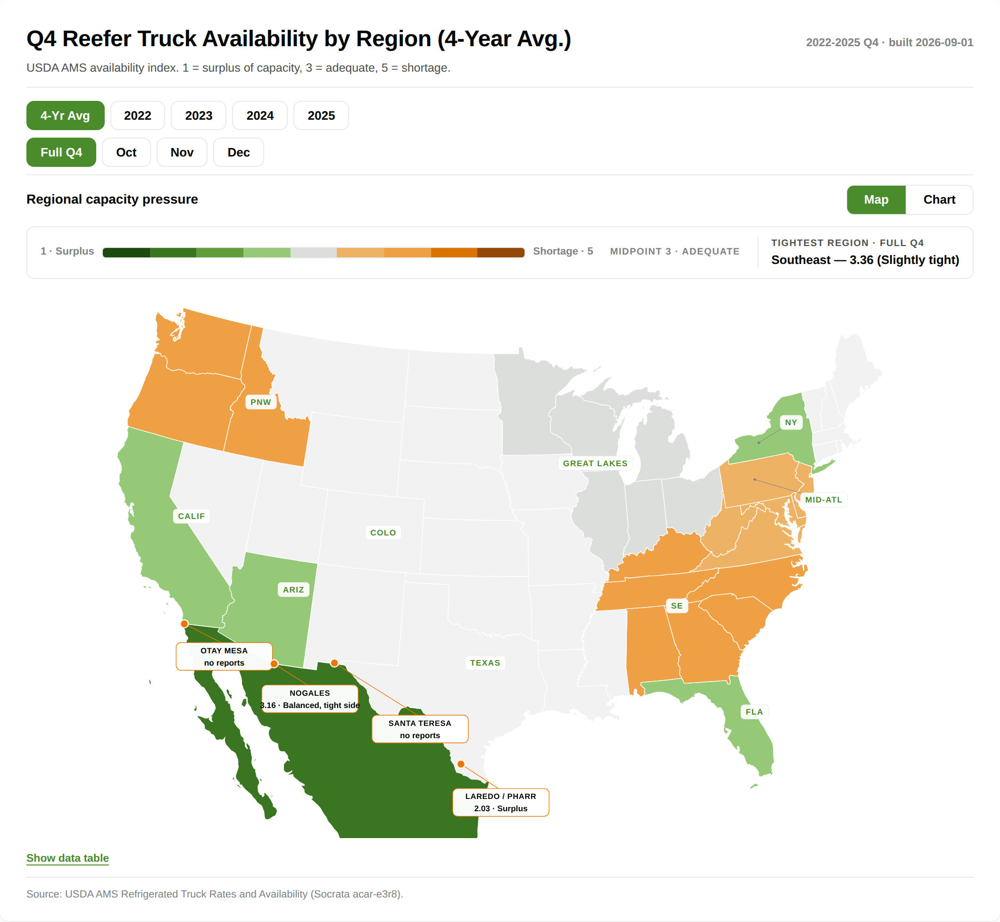

# 🚛 Truck Availability Tracker: automated reefer-capacity signals

> An automated pipeline that turns USDA refrigerated-truck data into a US heat map of regional capacity pressure, so a freight team can see where reefer capacity is tightening **before** it shows up in rates, and rebuilds itself on every run with zero manual work.




## 📊 The business question
Reefer (refrigerated-truck) capacity swings hard by region and season. If you can see **which lanes are structurally short vs. loose**, you can pre-book capacity, renegotiate lanes, or shift volume before a rate spike hits. This project answers: *where is Q4 reefer capacity tight, where is it loose, and how does that move across October, November, and December?*

## 🧠 Approach & trade-offs
USDA AMS availability data (a 1 to 5 index, where 5 = shortage and 1 = surplus) is aggregated to a **4-year Q4 average by shipping region** and painted onto a US choropleth, with a ranked diverging-bar view behind a toggle.

A few decisions worth calling out:

- **Diverging color, not sequential.** The decision-relevant signal is the *direction* from "adequate (3)," so the ramp runs green (surplus) to a neutral midpoint to orange (shortage) rather than one hue light-to-dark.
- **Bands tighten near the middle.** Q4 readings cluster far closer to adequate than Q3 ones do, so even-width bands across the full 1 to 5 scale left almost every district in one of three shades and the map looked frozen when you changed year. The cuts now cluster around 3, and every step is at least 8 points of L\* from its neighbour so a band change is actually visible. The cuts are fixed rather than fitted to the current selection, so a color means the same thing in every year and month, and readings past the end cuts clamp.
- **Color resolution and wording are set separately.** The cuts are fine enough for the map to move, but the labels stay anchored to what the index means: "Shortage" is held back to 3.8 rather than handed to a 3.4 that is only modestly above adequate.
- **Reporting month, not calendar month.** AMS attributes a marketing week to a month that is not always the month on the row's date: a week opening in late December carries month 12 on a January date. 572 of the Q4 2022-2025 rows disagree this way, so both the build and the browser read the dataset's own `month` column and only fall back to parsing `date` if it is ever renamed.
- **Regions are whole shipping districts.** Individual reporting origins (Indiana, Pennsylvania) roll up into the AMS district the map colors. Anything that cannot be placed is dropped rather than guessed at, since a mis-bucketed origin would silently recolor a whole district.

The build bakes a data snapshot into `index.html`, and the published page also re-queries Socrata on load, so an embedded copy stays current between deploys and still renders (with a visible notice) if that request cannot complete.

## 🔑 What the current window shows (Q4 2022-2025 average)
- **Mexico-Texas is the one region in real surplus** at about 2.0, and it tightens steadily through the quarter: roughly 1.5 in October to 2.7 by December. The cushion is an October and November story, not a December one.
- **The Southeast and PNW run tightest**, both a little above adequate at roughly 3.3 to 3.4. The Southeast's pressure is concentrated in November, near 3.9.
- **Q4 is a flat quarter.** Set those poles aside and every remaining district lands between 2.81 and 3.17, inside 0.2 of adequate. Q3's spread is far wider, so Q4 is a quarter to hold position in rather than one to pre-buy against.
- **Read the thin samples with care.** Mid-Atlantic's 3.17 rests on 12 reports across four years. Hovering any region shows its report count, and anything under 20 is flagged.

Figures above come from the snapshot committed in `data/`. The live page recomputes from the current USDA feed, so it can differ slightly.

## ✅ Decision this supports
Lean on the Mexico-Texas surplus early in Q4 while it is at its loosest, and treat Southeast capacity in November as the one window worth booking ahead. Everywhere else, Q4 does not justify paying up for coverage.

## 🛠️ Stack
Python (pandas) · D3 + TopoJSON · GitHub Actions (scheduled + on-push rebuild) · GitHub Pages

## ▶️ Run it locally
```bash
pip install -r requirements.txt

# CSV mode (no network needed):
python scripts/build_chart.py index.html

# Live USDA Socrata feed (what CI uses):
DATA_SOURCE=api python scripts/build_chart.py index.html
```
Then open `index.html`.

The Q4 window rolls forward on its own: each build covers the four most recent
completed Q4s. Pin a fixed window with `YEAR_MIN` / `YEAR_MAX` to reproduce a
previously published chart.

## 📂 Repo layout
```
.github/workflows/build-chart.yml  Build + deploy to Pages (push, weekly, manual)
scripts/fetch_data.py              Socrata client, region bucketing, Q4 window
scripts/build_chart.py             Aggregate region x year x month, render index.html
heatmap_template.html              Map, chart, legend, and table (D3 + TopoJSON)
index.html                         Generated page (published)
data/...csv                        Committed USDA export, the offline fallback
webflow-embeds/                    iframe snippet for the website
```

## 🌐 Embedding
`webflow-embeds/reefer-truck-availability.html` holds the iframe snippet for the Webflow Embed element.

## 📂 Data & license
Source: **USDA Agricultural Marketing Service (AMS)**, Refrigerated Truck Rates and Availability (Socrata dataset `acar-e3r8`). Code released under the [MIT License](LICENSE).
